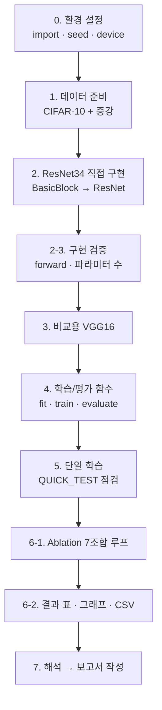

# AIFFEL Campus Online Code Peer Review Template

- **코더 :** A팀 (한승엽)
- **리뷰어 :** 추병곤

---

## PRT (Peer Review Template)

> 표시: ✅ 충족 / △ 부분 충족 / ⬜ 미확인
📸 = "근거 캡처 첨부" 항목 (실제 화면을 캡처해 붙여 넣을 위치를 표시함)
> 

---

### [✅] 1. 주어진 문제를 해결하는 완성된 코드가 제출되었나요?

- baseline(PyTorch Quickstart, FashionMNIST 분류기)을 출발점으로, 모델을 **직접 구현한 ResNet34**로 교체하고 데이터셋을 **CIFAR-10**으로 바꾼 노트북이 제출됨.
- 노트북이 **데이터 로드 → 모델 직접 구현 → 구현 검증 → 학습/평가 → ablation 실험 → 결과 표·그래프**까지 end-to-end로 실행되도록 구성됨.
- 요구 결과물 3종 모두 존재: ① ResNet34 직접 구현 노트북 ② Ablation 비교 보고서 ③ Playground 보고서.
- 📸 **근거 캡처:** 노트북 `6-1`(ablation 실행 로그) + `6-2`(결과 표·막대그래프·학습곡선) 출력 화면.
*(실험을 돌려 출력이 나온 화면을 캡처해 첨부)*

---

### [✅] 2. 핵심/복잡한 부분의 주석·docstring을 보고 코드가 잘 이해되었나요?

- **가장 핵심·복잡한 블록:** `BasicBlock` 클래스와 `ResNet._make_layer`.
- **왜 핵심인가:** ResNet의 정체성인 **residual connection**(`out = F(x) + shortcut(x)`)이 구현되는 부분이고, 채널·해상도가 바뀔 때 **1×1 projection shortcut**으로 차원을 맞추는 가장 까다로운 로직이 들어 있다.
- **주석/annotation 여부:** 있음. 예) `# 핵심: skip connection`, `# shortcut: 입력과 출력의 (채널 또는 해상도)가 다르면 1×1 conv로 맞춰줌`, `# 첫 블록만 stride 적용(다운샘플), 나머지는 stride 1`.
- **이해도:** 주석 덕분에 "왜 shortcut이 조건부로만 생기는지", "`use_residual` 플래그가 어디서 덧셈을 끄는지"가 명확히 읽힌다.
- 📸 **근거 캡처:** `2-1. BasicBlock` 셀 + `2-2. ResNet 본체`의 `_make_layer` 부분.

---

### [✅] 3. 에러 디버깅 기록 또는 새로운 시도·추가 실험을 수행했나요?

- **디버깅 기록:** no-BN 실험에서 loss가 **nan으로 발산**한 현상을 "버그가 아니라 BatchNorm 없이는 lr=0.1이 너무 크다는 예상된 결과"로 해석·기록함(보고서 7.2 / 해석 가이드).
- **추가 시도(평가 기준 외):**
    - `use_residual` / `use_bn` / `cifar_stem` **토글**로 한 모델에서 여러 조건을 실험
    - 비교용 **VGG16**을 함께 구현해 아키텍처 간 비교
    - `QUICK_TEST` 플래그(2 epoch 빠른 점검), `ResNet18` 헬퍼(빠른 실험용)
- 📸 **근거 캡처:** `6-1`의 `experiments` 리스트(여러 조합) + 해석 가이드의 no-BN 설명.

---

### [△] 4. 회고를 잘 작성했나요? (회고 ✅ / 실행 플로우 그래프 추가 권장)

- **회고:** `오늘의 회고` 문서에 **배운 점 / 어려웠던 점 / 아쉬운 점(KPT) / 느낀 점 / 다음에 시도할 것**이 상세히 기록됨. ✅
- **실행 플로우 그래프:** 현재 노트북에는 **명시적 실행 플로우 다이어그램이 없음.** → 추가하면 이해를 크게 도울 것(아래 "회고/개선"에 예시 첨부).
- 📸 **근거 캡처:** 회고 문서의 "배운 점"·"KPT" 섹션.

---

### [✅] 5. 코드가 간결하고 효율적인가요? (PEP8 일부 보완 권장)

- **함수화/모듈화: 우수.** `conv3x3`, `BasicBlock`, `ResNet`, `_make_layer`, `ResNet34/18` 팩토리, `build_transforms`, `get_loaders`, `train_one_epoch`, `evaluate`, `make_optimizer`, `fit`로 잘 분리됨. ablation 하니스가 **단일 `fit` 함수를 재사용**해 중복이 거의 없다.
- **PEP8: 대체로 준수.** 다만 `random.seed(SEED); np.random.seed(SEED)`처럼 **한 줄에 여러 문장**을 둔 부분과 일부 긴 줄은 "한 문장 한 줄 / 79~99자" 권장에 맞춰 정리하면 더 깔끔하다.
- 📸 **근거 캡처:** `fit` 함수 + `6-1` ablation 루프(함수 재사용 구조).

---

## 회고(참고 링크 및 코드 개선)

```
# 리뷰어 회고
- 직접 구현한 BasicBlock에서 projection shortcut이 "차원이 바뀔 때만" 생긴다는 점을
  코드로 보니, 논문의 identity shortcut vs projection shortcut 차이가 명확히 이해됐다.
- ablation을 하나의 fit() 함수로 돌리는 구조가 인상적이었다.
  "변수 하나만 바꿔 공정 비교"라는 원칙이 코드에 그대로 드러난다.
- 아쉬운 점: 결과 수치가 아직 비어 있어, 실행 후 표를 채우면 리뷰 항목 1·3·4가 더 탄탄해진다.

# 참고 링크
- ResNet 논문 (Deep Residual Learning): <https://arxiv.org/abs/1512.03385>
- torchvision datasets 목록: <https://docs.pytorch.org/vision/stable/datasets.html>
- CNN Explainer (Tiny VGG): <https://poloclub.github.io/cnn-explainer/>
```

### 코드 개선 제안 1) 실행 플로우 그래프 (PRT 4번 보완)

노트북 상단에 아래 mermaid 다이어그램을 markdown 셀로 추가하면 전체 실행 흐름이 한눈에 보인다. *(Notion은 `mermaid` 코드블록을 그대로 렌더링함)*



### 코드 개선 제안 2) 과적합 분석용 train 정확도 열 추가 (PRT 보완)

`6-2` 셀의 결과 표에 최종 train 정확도 열을 더하면, 보고서 7.3(데이터 증강·과적합)에서 train–test 격차를 표 하나로 바로 볼 수 있다.

```python
df = pd.DataFrame([{
    "실험": r["name"],
    "train_acc": round(r["history"]["train_acc"][-1], 4),  # ← 추가
    "best_acc": round(r["best_acc"], 4),
    "final_acc": round(r["final_acc"], 4),
    "params(M)": round(r["params"]/1e6, 2),
    "time(s)": round(r["time_sec"], 0),
} for r in results]).sort_values("best_acc", ascending=False)
display(df)
```
